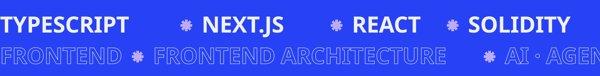

<!--
  ┌────────────────────────────────────────────────────────────────────────┐
  │  GitHub profile README — github.com/carlomigueldy                      │
  │                                                                        │
  │  Design system: Kinetic Cobalt — the system behind carlomigueldy.dev   │
  │  (senior-portfolio docs/DESIGN.md). Cool-paper light-canonical ground, │
  │  one cobalt accent (#2742F5), Archivo variable display voice,          │
  │  JetBrains Mono labels, hairlines + corner ticks, mono ( annotations ).│
  │                                                                        │
  │  GitHub's sanitizer allows no <style>/<script>/inline styles, so the   │
  │  visual layer lives in SVG assets under assets/ — emitted ONLY by      │
  │  scripts/generate-readme-assets.mjs (never hand-edit them).            │
  │  <picture> swaps light/dark via prefers-color-scheme; light is the     │
  │  canonical fallback. The band + footer are theme-invariant by design   │
  │  (always cobalt-on-paper / ink-on-paper, both themes — house rule).    │
  └────────────────────────────────────────────────────────────────────────┘
-->

<picture>
  <source media="(prefers-color-scheme: dark)" srcset="assets/hero-dark.svg">
  <source media="(prefers-color-scheme: light)" srcset="assets/hero-light.svg">
  
</picture>

<div align="center">

<a href="https://www.carlomigueldy.dev"></a>&nbsp;<a href="mailto:carlomigueldy@gmail.com"><picture><source media="(prefers-color-scheme: dark)" srcset="assets/chip-email-dark.svg"></picture></a>&nbsp;<a href="https://www.linkedin.com/in/carlomigueldy"><picture><source media="(prefers-color-scheme: dark)" srcset="assets/chip-linkedin-dark.svg"></picture></a>&nbsp;<a href="https://x.com/carlomigueldy"><picture><source media="(prefers-color-scheme: dark)" srcset="assets/chip-x-dark.svg"></picture></a>

</div>

> **I take ambiguous product requirements and turn them into shipped production systems.**



### `( 01 )` WHAT I ACTUALLY DO

I'm a **senior fullstack engineer** — 7+ years software, 4+ years specializing in Web3, with a daily AI-augmented engineering practice. I'm not just a frontend, backend, or smart-contract engineer — I'm the one who owns the feature from a Figma frame and a half-written spec all the way to a green CI run and a production deploy.

```ts
const carlo = {
  ownsEndToEnd: ["frontend", "backend", "smart contracts", "tests", "ci/cd", "deploy"],
  worksIn:      ["claude code", "codex", "multica ai"], // where I work, not tools I reach for
  designs:      ["mcp servers", "router orchestration", "agent harnesses", "hitl approval gates"],
  bestAt:       "turning vague product requirements into production systems",
  portfolio:    "https://www.carlomigueldy.dev",
  status:       "open to joining a team · senior software / fullstack / web3 / product roles",
};
```

---

### `( 02 )` SELECTED WORK

| `( year )` | `( build )` | `( org · role )` | `( ↗ )` |
|:---|:---|:---|:---|
| `2025` | **[RUMOUR — WEB3 SOCIAL TRADING ON HYPERLIQUID](https://www.carlomigueldy.dev/projects/rumour-social-trading)**<br><sub>Signal-first chatrooms that turn anonymous market intel into Hyperliquid perp positions. Owned the Farcaster Miniapp and LINE DappPortal shells end-to-end, the wallet-setup flow on Privy embedded wallets, the Tencent Chat messaging layer, and the perps trading UI — one React + Vite codebase shipping as a PWA and two mini-app shells.</sub> | <sub>AltLayer<br>·<br>frontend lead</sub> | [↗](https://rumour.app) |
| `2024` | **[AUTONOME — NO-CODE AI-AGENT DEPLOYMENT](https://www.carlomigueldy.dev/projects/autonome-agent-hosting)**<br><sub>Pick a framework, configure persona and keys, get a chat-ready agent in ~5 minutes. Owned the framework-discovery gallery, the new-agent deployment flow, the agent metadata editor, the env-vars dialog, and the Eliza framework's UI integration inside the unified AltLayer Wizard frontend.</sub> | <sub>AltLayer<br>·<br>product engineer</sub> | [↗](https://apps.autono.meme) |
| `2024` | **[LIMITLESS — PREDICTION MARKETS ON BASE](https://www.carlomigueldy.dev/projects/limitless-labs-prediction-markets)**<br><sub>Owned backend architecture (NestJS · Fastify · PostgreSQL, domain-driven design) and the smart-contract integration layer. Collapsed the manually-assembled market-creation flow into a single operator action — operators went on to run 10+ markets a day — shipping across four services: API, contracts, indexer, frontend.</sub> | <sub>Limitless Labs<br>·<br>founding engineer</sub> | [↗](https://limitless.exchange) |
| `2021–23` | **[ATLANTIS WORLD — WEB3 SOCIAL METAVERSE + $1M NFT SALE](https://www.carlomigueldy.dev/projects/atlantis-world-nft-sale)**<br><sub>Promoted from blockchain engineer to lead blockchain engineer. Owned 13 of 18 DeFi/Web3 protocol integrations end-to-end — Yearn, 1inch, Balancer, Aave, Perpetual Protocol, Lens, Filecoin, Snapshot, POAP and more — and ran the live shift for the community NFT sale that raised ~$1M in ETH.</sub> | <sub>Atlantis World<br>·<br>lead blockchain engineer</sub> | [↗](https://www.carlomigueldy.dev/projects/atlantis-world-nft-sale) |

<div align="right"><sub>

`( full index — including the MCP router, AltLLM, AltClaw + more → )` **[carlomigueldy.dev/work](https://www.carlomigueldy.dev/work)**

</sub></div>

---

### `( 03 )` THE STACK

```
frontend          react · next.js · typescript · tailwind · flutter
frontend arch     design systems · state & data fetching · pwa · miniapp shells (farcaster · line)
ai · agentic      claude code · codex · multica ai · mcp servers · router orchestration ·
                  multi-agent harnesses · context engineering · human-in-the-loop approvals
web3              solidity · foundry · hardhat · ethers · viem · wagmi · privy · gnosis safe ·
                  hyperliquid
backend           node · nestjs · fastify · hono · python · postgres · prisma · supabase · ddd
testing           playwright · synpress · vitest · msw · foundry
infrastructure    docker · kubernetes · gcp · aws · vercel · github actions
```

---

### `( 04 )` THE AI-AUGMENTED PRACTICE

I use Claude Code, Codex, Multica AI, and MCP-based workflows **every day** — not as autocomplete, but as a system. Harness engineering, context engineering, multi-agent orchestration: I tune action spaces, tool surfaces, approval points, and guardrails so autonomous agent teams produce work a senior engineer would actually ship. At AltLayer that meant MCP harnesses and router orchestration over large tool sets (~400 tools routed through ~20); at home it's a daily loop of custom skills, sub-agent orchestrators, and cross-verified security passes over production code.

> **The differentiator:** I don't just *use* AI tools. I design the orchestration around them — tool boundaries, approval gates, test coverage — so the output is production-ready, not prototype-grade.

---

### `( 05 )` THE ASK

I'm actively looking to **join a team** — senior software, senior frontend, senior blockchain, senior fullstack, or senior product engineer roles. IC, on a team. Best fit: teams building in Web3, AI-native software, fintech, developer tools, marketplaces, or product-led SaaS.

The shape of the work I do best:

- a small team where one engineer can own a meaningful surface area
- ambiguous problems that need a working answer, not a perfect one
- a culture that respects both shipping speed *and* test coverage

If that sounds like your team — **[carlomigueldy.dev/contact](https://www.carlomigueldy.dev/contact)** or `carlomigueldy@gmail.com`. I read everything.

<a href="https://www.carlomigueldy.dev/contact"></a>

<div align="center"><sub>

`( readme assets emitted by scripts/generate-readme-assets.mjs — kinetic cobalt, the design system behind carlomigueldy.dev )`

</sub></div>
