<!--
  ┌──────────────────────────────────────────────────────────────────────┐
  │  GitHub profile README — github.com/carlomigueldy                      │
  │  HTML here is limited to what GitHub's markup sanitizer allows:        │
  │  no <style>, no inline style="", no <script>. All visual design lives  │
  │  in the SVG assets (assets/banner.svg, assets/footer.svg), which are   │
  │  theme-adaptive (light/dark) and animate on load.                      │
  │  Swap the assets/* files anytime — paths stay the same.                │
  └──────────────────────────────────────────────────────────────────────┘
-->

<div align="center">



<br><br>

<a href="https://carlomigueldy.dev"></a>
&nbsp;
<a href="mailto:carlomigueldy@gmail.com"></a>
&nbsp;
<a href="https://linkedin.com/in/carlomigueldy"></a>
&nbsp;
<a href="https://x.com/carlomigueldy"></a>

</div>

> **I take ambiguous product requirements and turn them into shipped production systems.**

---

### `// what I actually do`

I'm a **senior fullstack engineer** with deep Web3 experience and a daily AI-augmented engineering practice. I'm not just a frontend, backend, or smart contract engineer — I'm the one who owns the feature from a Figma frame and a half-written spec all the way to a green CI run and a production deploy.

```ts
const miguel = {
  ownsEndToEnd: ['frontend', 'backend', 'smart contracts', 'tests', 'ci/cd', 'deploy'],
  shipsWith:    ['claude code', 'codex', 'mcp', 'sub-agents'],
  bestAt:       'turning vague product requirements into production systems',
  portfolio:    'https://carlomigueldy.dev',
  status:       'open to joining a team · senior software / fullstack / web3 roles',
};
```

---

### `// recent work worth talking about`

<table>
<tr>
<td width="50%" valign="top">

<br>
&nbsp;🛰&nbsp;&nbsp;<b>Rumour</b>&nbsp;&nbsp;
<br><br>
<sub><b>Web3 social trading on Hyperliquid.</b> Led frontend across the rumour-to-trade flow — owned the Farcaster Miniapp and LINE DappPortal shells end-to-end, the wallet-setup flow on Privy embedded wallets, the Tencent Chat messaging layer, and the perps trading UI on the Hyperliquid SDK. Ships as a PWA, Farcaster Miniapp, and LINE Mini Dapp from a single React&nbsp;+&nbsp;Vite codebase.</sub>
<br><br>

</td>
<td width="50%" valign="top">

<br>
&nbsp;🤖&nbsp;&nbsp;<b>Autonome</b>&nbsp;&nbsp;
<br><br>
<sub><b>No-code AI-agent deployment platform.</b> Owned the framework-discovery gallery, new-agent deployment flow, agent metadata editor, environment-variables dialog, and the Eliza framework UI integration inside the unified AltLayer Wizard frontend. Users pick a framework, configure persona and keys, and get a chat-ready agent in ~5 minutes.</sub>
<br><br>

</td>
</tr>
<tr>
<td width="50%" valign="top">

<br>
&nbsp;🎯&nbsp;&nbsp;<b>Limitless Labs</b>&nbsp;&nbsp;
<br><br>
<sub><b>Prediction markets on Base.</b> Architected the NestJS / Fastify / PostgreSQL backend using domain-driven design and automated the full market lifecycle into an orchestration system that let operators create 10+ markets a day. Collapsed the manually-assembled market-creation flow into a single operator action behind an internal form, REST API, and Gnosis Safe SDK approval link.</sub>
<br><br>

</td>
<td width="50%" valign="top">

<br>
&nbsp;🌐&nbsp;&nbsp;<b>Atlantis World</b>&nbsp;&nbsp;
<br><br>
<sub><b>Web3 social metaverse + $1M NFT sale.</b> Promoted from blockchain engineer to lead blockchain engineer. Owned 11 of 16 DeFi/Web3 protocol integrations end-to-end (Yearn, 1inch, Balancer, Aave, Perpetual Protocol, Moola, Lens, Filecoin, Snapshot, NFT.Storage, POAP) and ran the live shift for the community NFT sale that raised ~$1M ETH.</sub>
<br><br>

</td>
</tr>
</table>

---

### `// the stack, honestly`

```
languages      typescript · javascript · python · go · solidity
frontend       react · next.js · tailwind · shadcn · chakra · react hook form · zod
backend        node.js · nest.js · fastify · hono · postgres · prisma · ddd
web3           foundry · hardhat · ethers · viem · wagmi · privy · gnosis safe · tenderly
ai / agentic   mcp servers · tool & function calling · router orchestration ·
               human-in-the-loop approvals · claude code · codex · custom skills
testing        playwright · synpress · vitest · hardhat · foundry · unit · smoke · ci
infra          docker · kubernetes · gcp · aws · vercel · nginx · github actions
```

---

### `// my AI-augmented engineering practice`

I use Claude Code, Codex, Multica AI and MCP-based workflows **every day** — not as autocomplete, but as a system. I design task breakdowns, tool boundaries, approval points, and reliability checks so agent-assisted work is something a senior engineer would actually ship. I've built custom Claude Code skill orchestrators with sub-agents (security audit pass over two production products, triaged into an epic, fixes shipped with cross-verification on a local stack).

> **The differentiator**: I don't just *use* AI tools. I design the orchestration around them — tool surfaces, approval gates, test coverage — so the output is production-ready, not prototype-grade.

---

### `// what I'm looking for`

I'm actively looking to **join a team** — senior software, senior fullstack, senior frontend, or senior Web3 / blockchain engineer roles. Best fit: teams building in Web3, AI-native software, fintech, developer tools, marketplaces, or product-led SaaS.

The shape of the work I do best:

- a small team where one engineer can own a meaningful surface area
- ambiguous problems that need a working answer, not a perfect one
- a culture that respects both shipping speed *and* test coverage

If that sounds like your team — [carlomigueldy.dev](https://carlomigueldy.dev) or `carlomigueldy@gmail.com`. I read everything.

---

<div align="center">



</div>
